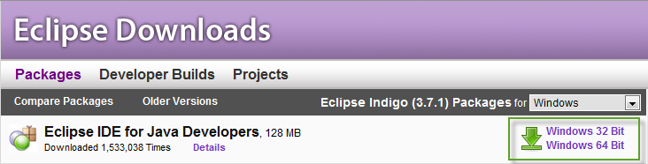

#Setting up a developer environment

This section describes the software requirements for running this toolkit and systematic instructions for the installation.

##Software Requirements

* Eclipse Indigo IDE for Java Developers.
* Android Development Tools (ADT) plugin for the Eclipse IDE.
* Android SDK 2.2 or above except the 2.3.3 which introduces a bug on the JavaScript to java bridge, more information can be found [here](http://code.google.com/p/android/issues/detail?id=12987).

##Installing Eclipse

1.	Download and Install the Java JDK from [http://www.oracle.com/technetwork/java/javase/downloads/jdk-7u1-download-513651.html](http://www.oracle.com/technetwork/java/javase/downloads/jdk-7u1-download-513651.html)
2.	Download Eclipse IDE for Java Developers from [http://www.eclipse.org/downloads/](http://www.eclipse.org/downloads/)

	

3.	Extract the eclipse folder wherever you want (e.g. c:\eclipse).
4.	Go to the folder and run **eclipse.exe**.
5.	Choose the workspace location e.g. C:\Users\{yourUser}\workspace and click on the “Use this as the default and do not ask again” option.

	

##Downloading the ADT Plugin

Use the Update Manager feature of your Eclipse installation to install the latest revision of ADT on your development computer.

Assuming that you have a compatible version of the Eclipse IDE installed, as described in Installing Eclipse, above, follow these steps to download the ADT plugin and install it in your Eclipse environment.

1.	Start Eclipse, then select **Help > Install New Software...**.
2.	Click **Add**, in the top-right corner.

	
	
3.	In the Add Repository dialog that appears, enter "ADT Plugin" for the Name and the following URL for the *Location*:
	
	https://dl-ssl.google.com/android/eclipse/
	
		

4.	Click **OK**.

	> **Note**: If you have trouble acquiring the plugin, try using "http" in the Location URL, instead of "https" (https is preferred for security reasons) or if you are behind a proxy server you can follow the steps described in the How to configure proxy settings in eclipse section. 

5.	In the Available Software dialog, select the checkbox next to Developer Tools and click **Next**.
	
	
	
6.	In the next window, you will see a list of the tools. Click Next.
7.	Read and accept the license agreements, then click Finish.

	> **Note**: If you get a security warning saying that the authenticity or validity of the software cannot be established, click **OK**.

8.	When the installation completes, restart Eclipse.

##Installing and configuring the Android SDK

1.	After restarting Eclipse, a new window will appear to configure the SDK, leave the default options and provide the folder where the SDK will be installed.

	

	> **Note**: It is recommended to choose a location without blank spaces, since there were known issues in previous versions.

2.	Choose if you are going to contribute with Google’s statistics.

	
	
3.	Select the **Accept All** option for package descriptions and licenses and click the **Install** button.
	
	
	
	> **Note**: It takes a couple of minutes to start the installation.

4.	Restart **ADB**.

	

5.	Go to **My Computer** and right-click **Properties**.
6.	Click the **Advanced system settings** link.

	
	
7.	Under the **Advanced** tab, click the **Environment Variables** button, and in the dialog that comes up, double-click **Path** (under System Variables).

	
	
8.	Add the full path to the tools and platform-tools, those folders are located inside the destination you provided when installing the SDK (e.g. c:\bin\android-sdks\tools & c:\bin\android-sdks\platform-tools).

	
	
9.	Switch back to Eclipse.
10.	Open the **Android SDK Manager** from Window menu.

	

11.	Since the project is targeted to the **API 10**, select from the **Android 2.3.3 (API 10)** node only the **SDK Platform** and **Google APIs by Google Inc.** items, then click the **Install 4 packages…** button.

	
	
12.	Accept all package descriptions & licenses when prompted and click **Install**.

	
	
13.	Restart **ADB**.

	
	
14.	Close the Log window and the **Android SDK Manager**.
15.	Open the **AVD Manager** from the **Window** menu item.

	
	
16.	Click the **New…** button to create a new virtual device targeted to the API 10.
17.	Provide a valid name; select the **Android 2.3.3 – API Level 10** from the drop-down list and click on **Create AVD** button.

	
	
18.	Start the virtual device to check that it is working fine.

	
	
19.	If you want, you can scale the device to the real size.

	
	
20.	This is how the virtual device should look like.

	
	
	> **Note**: It may take a few minutes to load.

You can find more information about Android development in Android’s Developers website at [http://developer.android.com/index.html](http://developer.android.com/index.html)

##How to configure proxy settings in Eclipse

If your computer is behind a proxy server, you should follow these steps.

1.	Open the **Window -> Preferences** menu option.
2.	Select Network Connections on the left pane.

	

3.	Choose **Manual** from the drop-down list.

	

4.	Select HTTP in the list, click the Edit button, and provide your proxy configuration.

	
	
5.	Click **OK**.
6.	If you want to access to an https address you should perform the steps described above but clicking on **HTTPS** instead.
7.	Click **OK** on the **Preferences** window.
